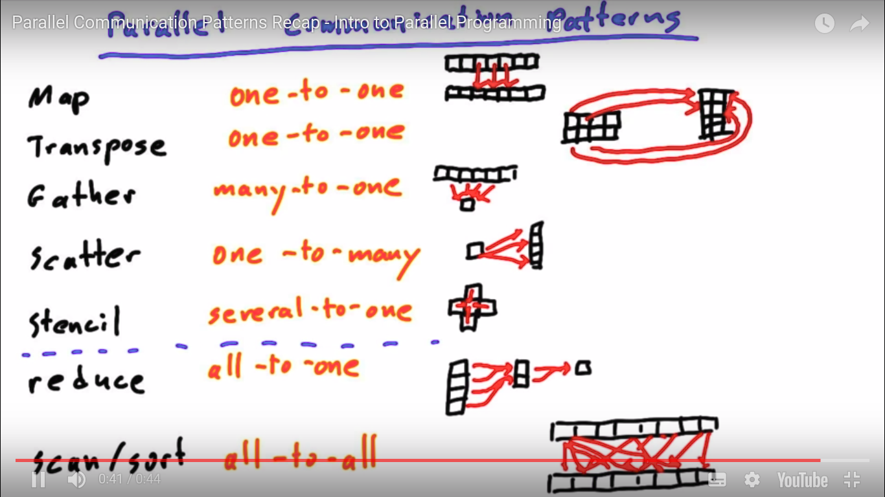
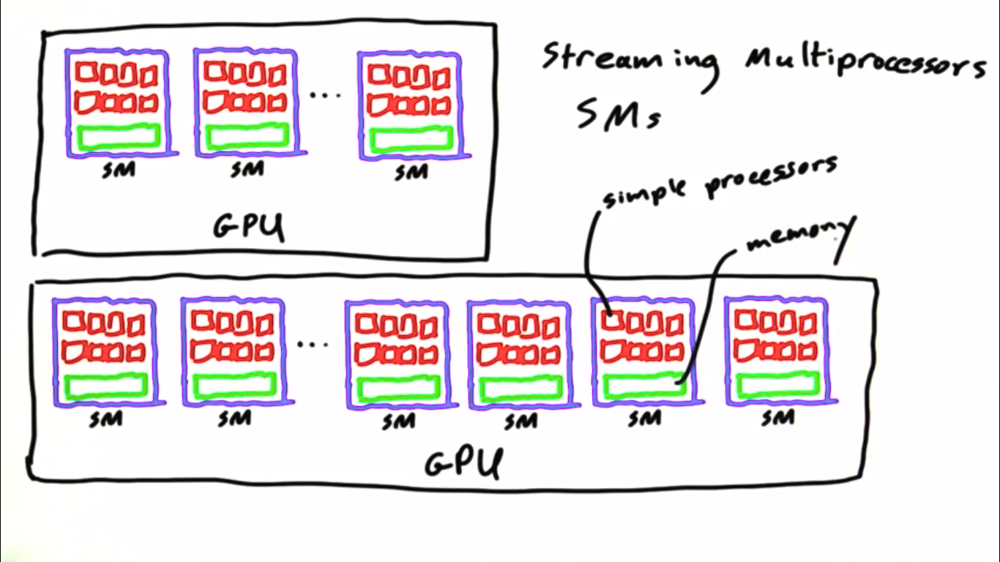
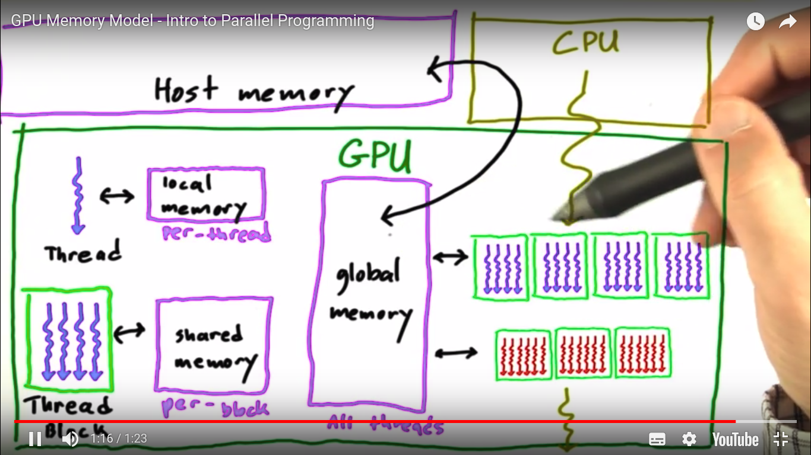

# Parallel-Computing
This repository was made to store and guide my studies about parallel computing using CUDA

**Table of Contents**
 - [Parallel Communication](#parallel-communication)
 - [CUDA Guarantees](#cuda-guarantees)

## Parallel Communication
Parallel Programmming Paradigm requires
some special communication design between GPU threads.

 - **MAP** (One-to-One)
    - This pattern compute each data given by the host and write some result for each data in different memory addresses.
 - **Transpose** (One-to-One)
    - Reorganize structure of the data storage inside memory
 - **Gather** (Many-To-One)
    - This pattern compute a set of data given by host and generate a single result on each thread.
 - **Scatter** (One-To-Many)
    - This pattern compute some data given by host and write and same result in different memory addresses.
 - **Stencil** (Several-to-One)
     - Like gather pattern, this pattern get a set/struct of data given by host,compute and write result in a single memory address.

  

## Leaning About GPU and CUDA

### GPU Hardware
  - In high level, GPU is a bunch of Streaming  Multiprocessors (SM)
  - GPU is responsible to allocate blocks of SM's
  - An SM may can run more than one thread block
  - Some thread block can't be executed on more than one SM
  - Have 3 types of memory inside of an GPU (local memory, shared memory ,  global memory)
  - Only each thread can acess data stored in their own local memory
  - Only all threads of some block can acess their own shared memory
  - Every thread in every block can acess data in global memory

  
   GPU SM's Design

  
   GPU Memory Design

### CUDA Guarantees
 - A thread block is a group of threads that cooperate to solve a sub-problem
 - All threads in a block run on the same SM at the same time
 - All blocks in a kernel finish before any blocks from the next kernel run

